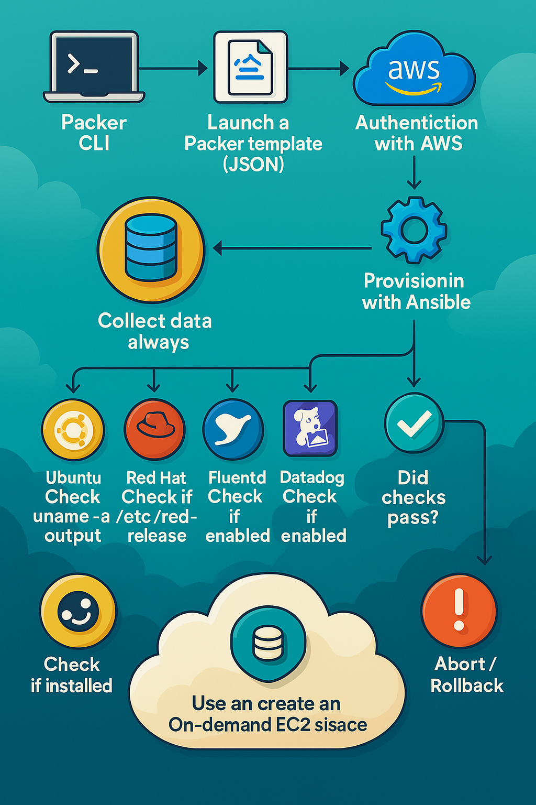

# 🧪 ami-service-checks

**A reusable Ansible playbook for validating AMI readiness during Packer builds.**  
Make sure your golden images are actually ready — without brittle shell scripts.

---

## 🔍 Why This Exists

Golden images are great — until your Vault agent doesn’t start, SSHD fails silently, or your observability stack is missing.  
This playbook gives you **early failure visibility** by validating runtime services *before the AMI is ever shared*.

✅ Lightweight  
✅ Read-only  
✅ Deterministic  
✅ CI/CD friendly

---

## 🧭 Lifecycle Diagram

This image shows how Packer, AWS, and Ansible interact to validate your AMI at build time:



---

## 📸 Illustrated Version

Prefer visuals? Here's a mobile-friendly version too:

👉 [Download alternate mobile-friendly version](./A_flowchart_infographic_illustrates_the_process_of.png)

---

## 🛠 How It Works

1. Packer boots an EC2 instance
2. Ansible runs **locally inside** the image being built
3. The playbook performs **read-only validation** of services and OS traits
4. Failing checks abort the build early

---

## ✅ Services Validated

| OS Condition         | Validations Performed                   |
|----------------------|-----------------------------------------|
| Amazon Linux 2       | Check for `amazon-ssm-agent`            |
| Amazon Linux 2023    | Check `vault`, `sshd`                   |
| Rocky Linux          | Check `vault`, `sshd`                   |
| Debian               | Check `vault`, `sshd`                   |
| Ubuntu               | Check `vault`, `sshd`                   |
| All Distros (if present) | Check `datadog-agent`, `td-agent`   |

---

## 🧾 Example Packer Config

```hcl
provisioner "ansible-local" {
  playbook_file    = "service-check-playbook.yml"
  extra_arguments  = ["--check"]
}
```

---

## 📚 References

- [Packer Ansible Local Docs](https://developer.hashicorp.com/packer/plugins/provisioners/ansible/ansible-local)
- [Ansible Facts & Variables](https://docs.ansible.com/ansible/latest/playbook_guide/playbooks_vars_facts.html)
- [Checkov (Security Scanning)](https://www.checkov.io/)
- [Best Practices for AMI Hardening (AWS)](https://aws.amazon.com/premiumsupport/knowledge-center/ami-hardening/)

---

*Brought to you by an SRE who prefers certainty over surprise.* 🧠🔐
